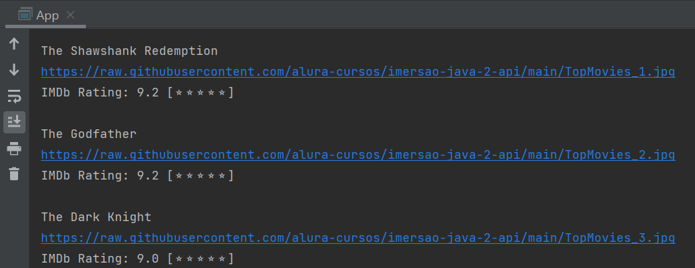
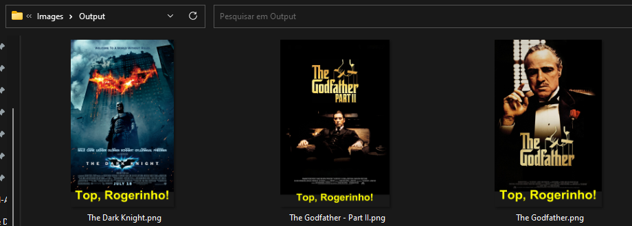

# Imersão Java Alura - API Movie Stickers

## Tecnologias Utilizadas
- Java 11
- Intellij IDEA
- Maven
- POO

## Aula 01: Consumindo API de Filmes com Java
### Objetivos: 
- Fazer uma conexão HTTP e buscar os top 250 filmes: [App.java](src/main/java/App.java)
- Extrair somente os dados que interessam (título, pôster e classificação): [JsonParser.java](src/main/java/JsonParser.java)
- Manipular e exibir os dados: [App.java](src/main/java/App.java)

📂 [Arquivo Alternativo ao site IMDB: Top 250 filmes](https://imdb-api.com/en/API/Top250Movies/k_0ojt0yvm)

### Resultados:

## Aula 02: Gerando figurinhas para WhatsApp com Java
### Objetivos:
- Ler a URL de uma imagem a partir do JSON: [StickerGenerator.java](src/main/java/StickerGenerator.java)
- Criar uma imagem com transparência e escrever um texto de recomendação
- Gerar um Sticker de Whatsapp com a imagem gerada
- Excluir ou limpar a pasta "Images/Output" toda vez que o programa for reiniciado

#### Melhorias a serem implantadas posteriormente:
- Centralizar o texto da imagem 
- Mudar o texto de acordo com a classificação (rating)
- Deixar o tamanho da fonte proporcional ao tamanho da imagem

# Desenvolvedora

| [ Leticia Prudente](https://www.linkedin.com/in/leticia-macedo-prudente-de-carvalho/) |
 
